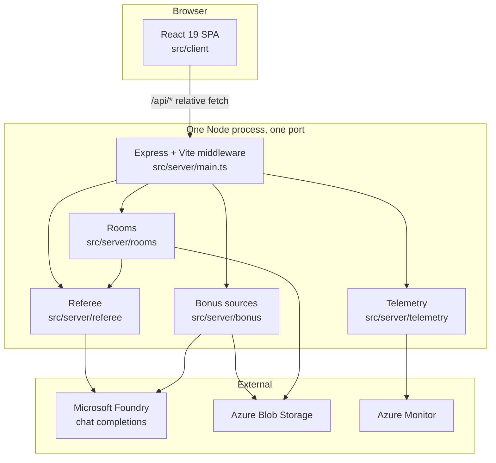
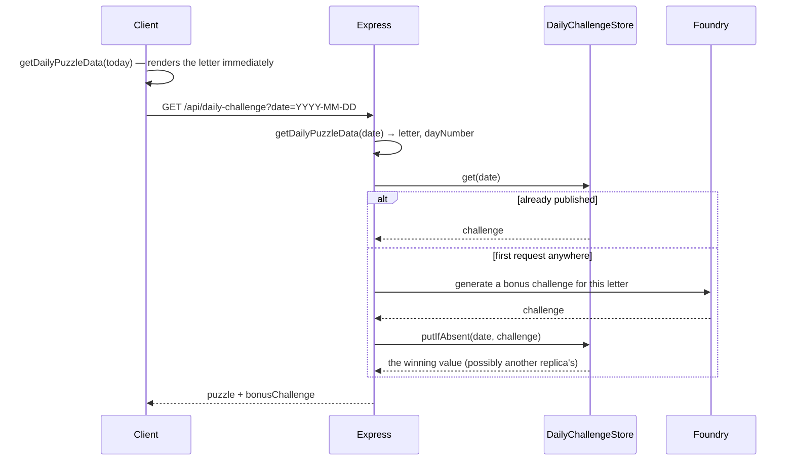
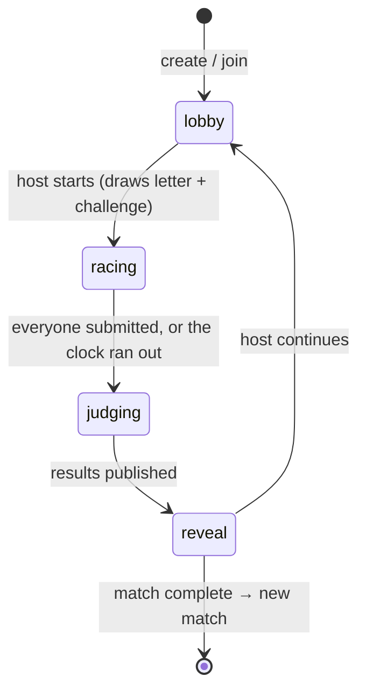
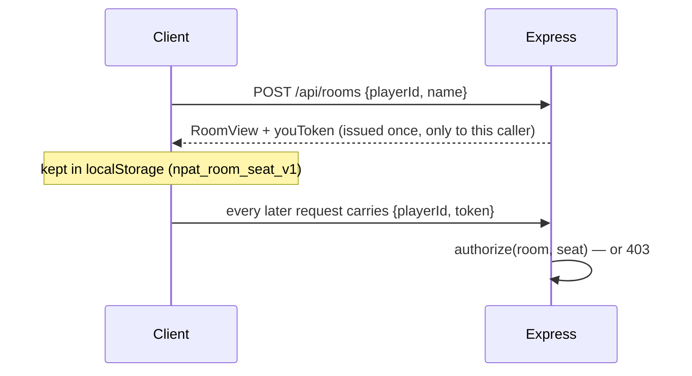
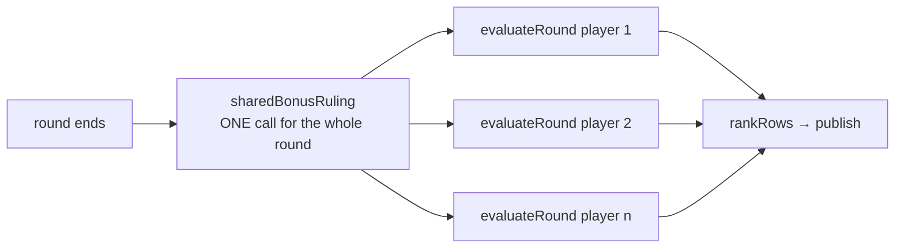

# Architecture — Letters Daily (NPAT)

A daily "Name, Place, Animal, Thing" word game with two modes — **Daily** and **Multiplayer rooms** —
served by one Express process that also hosts the React client and proxies answer judging to a model
on Microsoft Foundry.

This document explains how the system is put together and, more importantly, **why**: nearly every
structural decision here is the fix to a bug that actually happened. Rules short enough to state as
rules live in `.github/copilot-instructions.md`; this is the longer form.

⚠️ **The source carries no comments** — they were removed deliberately. These two documents are
therefore the only place the reasoning survives. When you change something load-bearing, record why
here.

---

## 1. The shape of the system



**One process, one port.** `src/server/main.ts` is the entry point for both tiers. In development it
imports Vite and mounts `vite.middlewares` in `middlewareMode`; in production (`NODE_ENV=production`)
it serves static `dist/` with an `app.get('*')` SPA fallback. There is no separate dev server and no
proxy configuration — which is why the client can `fetch('/api/...')` with relative URLs, and why
there is no CORS layer anywhere.

**Everything degrades.** No external dependency is required to run the game:

| Dependency | Configured by | Absent means |
|---|---|---|
| Microsoft Foundry | `AZURE_OPENAI_ENDPOINT` + `AZURE_OPENAI_JUDGE_DEPLOYMENT` + `AZURE_OPENAI_BONUS_DEPLOYMENT` | Heuristic judge, built-in bonus challenges |
| Daily challenge store | `DAILY_CHALLENGE_STORAGE` | Per-process caching (correct at one replica) |
| Room store | `ROOM_STORAGE`, or `ROOMS_SINGLE_REPLICA=true` | Rooms **disabled** in production, in-memory in dev |
| Telemetry | `APPLICATIONINSIGHTS_CONNECTION_STRING` | No-op adapter, no null checks at call sites |

Auth to Foundry is Entra ID via `DefaultAzureCredential` — there is no API key anywhere. A *partial*
Foundry configuration is fatal at startup by design: silently degrading on a typo means paying for AI
judging that never happens.

---

## 2. Tiers, and the arrows between them

```
              src/shared/            isomorphic: contract.ts (wire types),
              ▲         ▲            puzzle.ts (the daily derivation)
              │         │
        src/client/   src/server/    ← never import from each other
```

- **`src/shared/`** — the only code both tiers run. No `window`, no `localStorage`, no Node built-ins,
  and no imports from either tier. `contract.ts` holds the wire types; `puzzle.ts` holds the daily
  derivation, shared because the client derives the puzzle optimistically to render before the
  network answers, and the two derivations must agree exactly.
- **`src/server/`** — server-only. This is what keeps the LLM SDK, the prompts and the scoring rules
  out of the browser bundle.
- **`src/client/`** — browser-only. `types.ts` holds only what never leaves the browser
  (`GameResult`, `GameStats`, `CategoryInfo`); everything on the wire comes from
  `../../shared/contract`.

Types go where their *narrowest* audience is. Promoting a type to `src/shared/` is what makes it a
contract, so it is a deliberate act rather than a convenience.

---

## 3. Ports and adapters

Every external dependency sits behind a small interface with at least two implementations — one real,
one for tests — and composition happens exactly once, in `main.ts`.

| Port | Adapters | Composed as |
|---|---|---|
| `Judge` | `createAzureJudge`, `heuristicJudge` | `withFallback(azure, heuristic)` |
| `BonusAdjudicator` | `createAzureBonusAdjudicator` | optional; absent = per-player rulings |
| `BonusChallengeSource` | `createAzureBonusSource`, `randomBuiltinSource`, `deterministicSourceForDate` | `withBonusFallback(ai, builtin)` |
| `DailyChallengeStore` | `createBlobStore`, `createMemoryStore`, `nullStore` | by `DAILY_CHALLENGE_STORAGE` |
| `RoomStore` | `createBlobRoomStore`, `createMemoryRoomStore` | by `ROOM_STORAGE` / `ROOMS_SINGLE_REPLICA` |
| `Telemetry` | `createAzureMonitorTelemetry`, `noopTelemetry` | by whether instrumentation started |

Two conventions make this work:

- **Every adapter takes an injected client.** `createAzureJudge(client, deployment)` accepts an
  `OpenAI` client rather than constructing one — that is what makes it testable with a fake.
- **The `model` argument is the *deployment* name**, not the model name — the single easiest thing to
  get wrong on Azure. The SDK's `AzureOpenAI` class is deliberately **not** used: it demands an
  `apiVersion` and rewrites requests onto the legacy `/openai/deployments/{name}/` path. The base
  `OpenAI` client is used instead, with `apiKey` set to a token-provider function the SDK calls per
  request, which is what refreshes expiring Entra tokens. The scope is
  `https://ai.azure.com/.default`; the older `cognitiveservices` scope 401s here. Both facts are
  pinned by tests.

---

## 4. Mode 1 — the Daily puzzle

One letter a day, the same for everybody, played once.



### Determinism is a frozen constant

`getDailyPuzzleData(dateStr)` hashes the `YYYY-MM-DD` string, picks a letter from `AVAILABLE_LETTERS`
(21 letters — Q/U/X/Y/Z are excluded as unplayable), picks a fallback challenge, and derives
`dayNumber` from a `2026-01-01` epoch. There is no database of puzzles.

> ⚠️ Changing the hash, the letter list or the epoch **retroactively rewrites every past puzzle**.
> The same is true of the first `DETERMINISTIC_CHALLENGE_COUNT` (7) entries of `BONUS_CHALLENGES`:
> the derivation indexes that prefix, and it was once `% BONUS_CHALLENGES.length`, which meant
> appending a single challenge silently changed which one every past date resolved to. Add challenges
> by **appending below the marker** in `puzzle.ts`; the extras are drawn by room rounds and the
> random fallback, neither of which has to agree with history. `puzzle.test.ts` pins the prefix, its
> order, and golden letter/challenge/`dayNumber` values for known dates.

### One challenge per date, across every replica

The *letter* is derived; the *bonus challenge* is normally generated by a model, so it needs
coordinating. Two layers, both required (`cachedPerDate` in `src/server/bonus/types.ts`):

1. **The store** is the source of truth every replica reads. A replica that generates one publishes
   with `putIfAbsent`, so the first writer wins and the rest adopt that value rather than overwriting
   it.
2. **An in-process map** caches the in-flight *promise*, so the common path costs no network call and
   a first-request stampede collapses into one generation. A rejected promise is evicted, so a
   failure cannot poison the day until restart.

The in-process map **alone is only correct for a single replica** — without the store, each replica
generates and serves its own daily challenge. This project has had that bug once already.

### Playing a round

All daily-game state lives in `useDailyGame.ts` (no router, no state library) and is passed down as
props by `App.tsx`. `CategoryInputForm` runs a 60-second clock and three lives; running out of time
costs a life and resets the clock to 15 seconds.

> ⚠️ Elapsed time is measured from a round-start timestamp, never derived as
> `timeLimitSeconds - timeLeft` — that formula reported 45 seconds for a round that had already run
> past a minute, because losing a life resets the clock.

**Scoring failure is not silently faked.** The client has no local validator. If `/api/validate`
fails, `useDailyGame` exposes an error (rendered by `DailyGameScreen`) and does **not** record the
round, so streak stats cannot be corrupted by a guess. The puzzle *fetch* does fall back to `getDailyPuzzleData`, so the letter still renders
offline.

---

## 5. Mode 2 — Multiplayer rooms

Up to 8 players race the same letter on a 4-character room code. A room plays its **own** random
letter, never the daily one, and its results never touch the streak or the saved stats — which keeps
the daily puzzle exactly as it is: one letter a day, played once, with nothing about rooms able to
corrupt it.

### 5.1 The state machine



`src/server/rooms/roomState.ts` is the whole machine, and it is **pure and clock-injected**: every
function takes `now`, so the entire lifecycle is testable without timers.

| Rule | Value | Why |
|---|---|---|
| `roundSeconds` | 60 | Same as the solo round |
| `submitGraceSeconds` | 3 | Every client auto-submits at zero, and that request has to cross the network |
| `maxPlayers` | 8 | Bounds contention on one room blob |
| `presenceTimeoutSeconds` | 20 | Polling has no disconnect event; absence is inferred from silence |
| `emptyGraceSeconds` | 120 | A refresh looks exactly like leaving |
| `judgingClaimSeconds` | 45 | Long enough for a slow model call, short enough that a dead replica costs one wait |
| `defaultRounds` | 3 | The host picks from `ROOM_ROUND_CHOICES`, locked once round one starts |

### 5.2 Rooms advance lazily, on read

There is no timer and no sweeper. The app scales to zero, and a background job would keep a replica
alive purely to watch a clock. Every entry point loads the room, advances it to `now`, acts, and
saves. A room only ever moves when someone is looking at it — which is exactly when it matters.

The consequence: a room everybody walked away from is never read, so it never expires. Creation is the
one moment that cares, so creation is what cleans up (`freeIfDead`) — a code is only refused by a room
that is still alive.

### 5.3 Transport: polling, not sockets

`ROOM_POLL_MS = 1500`. Polling is the only transport that survives several replicas without a message
backplane, because the room in the store is already the source of truth. The poll doubles as the
presence heartbeat.

> ⚠️ A poll only *writes* when it has something to save. `touch()` reports whether the heartbeat is
> worth persisting (roughly every 5s, well inside `presenceTimeoutSeconds`); reaping and deadlines are
> re-derived on every load, so a view is correct either way. Writing on every poll meant eight players
> produced ~5 conditional writes a second against one blob — contention the judging publish has to
> win.

### 5.4 Concurrency: optimistic, and every change is a redo

Two players in one room are routinely served by different replicas. Every mutation is a
read-modify-write, so writes are **conditional on the version the room was read at**
(`StoredRoom.version`, an ETag in the blob adapter). A writer that loses gets `RoomVersionConflict`
and **redoes its change against fresh state** rather than forcing it through — which is why every
change is expressed as a synchronous function of the room: it has to be safe to run again.

Without this, two players submitting at once on different replicas would each save a room built from a
copy that predated the other, and one submission would simply vanish.

### 5.5 Judging happens exactly once, for exactly one round

Judging is the one step that cannot be repeated: it calls the model and then adds a round to the
standings, so two replicas doing it would score the round twice — and unlike a lost write, that damage
is permanent.

- The claim is a **timestamp in the shared room** (`judgingSince`), not a flag in a process, and the
  conditional write settles who gets it. It goes stale on purpose, so a replica recycled
  mid-judgement does not leave the room waiting on a process that is never coming back.
- The claim also records **which round** it is judging (`judgingRound`), and `claimStillHolds()`
  re-checks that before publishing. ⚠️ The phase alone is not enough: a claim that went stale during a
  slow model call came back to a room that was judging the *next* round, published the old round's
  rows into it, scored one round twice and threw the new one away.
- The publish retries harder than any other write (`MAX_PUBLISH_ATTEMPTS`), because losing that race
  discards a model call that has already been paid for.

### 5.6 Security model: an id names a seat, a token owns it



> ⚠️ Player ids are **public**: `toView` sends every player's id to every player, and result rows carry
> them too. Authorising on the id alone therefore let anyone who had merely read a room act as anybody
> in it — submit blanks as a rival (and `submit` is idempotent, so the impersonated blank then buried
> their real answers), start a round as the host, wipe the standings, or mark a rival absent so the
> round stopped waiting for them.

`authorize()` gates **every** entry point, reads included, since a view carries other players' names
and, at the reveal, everybody's answers. A returning player presents the token they were issued, which
is what lets a refresh reclaim a seat; anyone presenting the wrong one is refused in the same words as
a stranger — telling an attacker which of the two they got wrong is telling them how close they are.

Other integrity rules:

- **The clock is the server's.** `RoomSubmission.timeTakenSeconds` is measured from the server's own
  round start; the client never reports it, because here it decides who beat whom.
- **`start` authorises against the room as read *before* drawing a puzzle.** Drawing one is an AI
  call, so checking afterwards meant anyone who could name a live room code could spend one per
  request.
- **`toView` never leaks another player's answers mid-round.** Results are attached only at reveal.
- **Duplicate answers do not score less.** Each player is scored exactly as a solo round is; ranking
  is only a sort, breaking ties on time. `tied` is a property of the *rank*, not of the row above —
  deriving it from the comparison alone told the leader of a two-way tie they had won outright.

### 5.7 Creating a room is rate limited

`POST /api/rooms` is the one room endpoint an anonymous caller can hit without already holding a
seat, and every call mints a code and writes a room to storage. It is therefore the only one behind a
limiter: `createRateLimiter` in `src/server/rooms/rateLimit.ts`, keyed on the client IP, defaulting to
**10 creations per 10 minutes** (`ROOM_CREATE_LIMIT` / `ROOM_CREATE_WINDOW_SECONDS`). Over the limit
the request is refused with `429` and a `Retry-After` header, and the body carries the same
`{ error }` shape as every other room failure, so the client renders it in the landing error banner
with no special case.

Joining, polling and playing are **not** limited: they all require a seat token, polling is the normal
mode of play at `ROOM_POLL_MS`, and throttling a poll would break the game rather than protect it.

It is a **sliding window, and only allowed requests are counted.** Counting refusals too would mean a
client stuck in a retry loop pushed its own recovery further away with every attempt and never got
back in; as it stands the window drains on schedule no matter how hard the caller knocks.

> ⚠️ **The limiter is per replica, so the real ceiling is `limit × replicas`** — up to 5× on the
> deploy script's defaults. It is a guard against a runaway client or a casual flood, not a quota. A
> shared counter would need a storage round trip per attempt, which costs more than the create it is
> protecting; if a precise global limit is ever needed it wants a cache, not a blob.

> ⚠️ **The limiter is only as good as `req.ip`, which is why `trust proxy` is set.** Container Apps'
> ingress appends the real client IP to `X-Forwarded-For`, and Express reads it back by hop count —
> `TRUST_PROXY_HOPS`, default `1`. Left at Express's default of `false`, `req.ip` would be the
> *ingress*'s address, every visitor would share one bucket, and ten rooms an hour from anyone would
> have throttled everybody. Raising the hop count past the number of proxies actually in front of the
> app is the opposite failure: callers could then spoof `X-Forwarded-For` and get a fresh bucket per
> request.

Throttled requests need no telemetry of their own: the auto-instrumentation already records the
request with its `429`, so `requests | where resultCode == 429` answers it.

### 5.8 Judging a room round



Players are judged in **separate, parallel calls** — deliberately, so one player's content-filter
rejection cannot take down everyone else's round, and because no player's score depends on another's.
The bonus rule is the one thing those independent calls cannot be trusted with; see §6.4.

---

## 6. The referee

`src/server/referee/` is the only place a round is scored. Judges rule on words; they never assign
points and never see the clock (`JudgeRequest` deliberately omits `timeTakenSeconds`), so a judge
cannot influence the speed bonus.

### 6.1 The pipeline

```
judge.judge(request)        ← Azure, or heuristic on failure
  → applyBonusRuling(…)     ← the round-wide ruling (rooms only)
  → enforceBonusRule(…)     ← mechanical rules, decided in code
  → enforceSuggestions(…)   ← drops advice the game cannot stand behind
  → scoreVerdict(…)         ← points, speed bonus, totals
```

Bonus authority runs **least-trusted last**: the shared ruling overrules the per-player judge, and the
mechanical check overrules them both.

### 6.2 Scoring

`SCORING` in `scoring.ts` is the single source of truth — these numbers previously lived in three
places (the prompt, a local validator, and a second copy of the speed ladder) and had already drifted.

| | Points |
|---|---|
| Valid answer | 10 |
| Valid answer that also matches the bonus | 15 |
| Invalid answer | 0 |
| Speed bonus | 20 (≤20s), 10 (≤35s), 5 (≤50s) |

> ⚠️ **The speed bonus requires all four answers to be valid.** It rewards a round answered well *and*
> quickly — four blanks submitted instantly used to score 20. Matching the bonus challenge is *not*
> required: a right answer that misses the bonus is still right.

The bonus is scored **per category** (`validAnswerWithBonus` vs `validAnswer`), so a category that
missed it loses points of its own whether or not the round met the challenge overall.

A rule's `scope` decides what "met" means, and it is not always a count: `all` needs four, `some` needs
`bonusChallengeThreshold` (2), and a category key needs only that one. Counting *every* rule against a
threshold of two was a real bug — four of the seven built-in challenges constrain a single category
("the Thing must be edible"), so at most one answer could ever match and they were impossible to
complete.

### 6.3 The model is not trusted with anything mechanically decidable

Four guards sit between the judge and the score, every one added after live output was observed
getting it wrong:

| Guard | What it settles | The failure that caused it |
|---|---|---|
| `withOnlyMatchingLetters` / `enforceTargetLetter` | The target letter, in both directions | `Tiger` scored full marks for **S**; `Lizabeth` was failed for **L**. Wrong-letter answers are *blanked before* the model sees them, so a judge cannot reject a word on letter grounds at all |
| `enforceBonusRule` | Any rule with a mechanical `checkKind` | Asked to apply one identical challenge to one identical set of answers **eight times, the model gave three different verdicts** and scores from 65 to 80 |
| `enforceSuggestions` | Whether "Try: …" advice is honest | Under **H** with a "must contain `hh`" rule, a rejected Name was offered `Rhythm` — not a name, not an H, no double H |
| Schema field order | `bonusEvidence` is generated before `bonusMatched` | Structured output is generated in schema order, and the model asserted bonus matches its own feedback then contradicted |

`checkKind: 'none'` means the rule needs world knowledge — a theme, a famous person, whether something
is edible — and stays with the judge. Whether a *suggested* word is a real member of its category
likewise stays with the judge: it is world knowledge, and nothing in code can catch `Samm`.

### 6.4 The round-wide bonus adjudicator

A knowledge-based rule ("at least 2 answers must relate to a colour") is neither mechanically decidable
nor safe to leave to per-player calls: the model applied it differently to each player, and two players
in one room answering equally well got different bonus verdicts.

So for rooms, `sharedBonusRuling` asks **once** for the whole round — every player's *distinct* answers
in one request at `temperature: 0` — and `applyBonusRuling` holds everyone to that single ruling. It is
skipped for a lone racer, for a mechanical rule, and when nothing is scoreable; a failed adjudication
logs and falls back to per-player rulings, because losing consistency must never cost anybody their
round. The adjudicator rules **only** on the bonus (validity and the letter are settled elsewhere), and
a ruling on a word nobody wrote is dropped rather than trusted.

> ⚠️ It is also the one prompt carrying several players' words in a call whose result binds all of
> them, so answers are JSON-quoted and declared to be data, and control characters are stripped when
> answers are read. An instruction-shaped answer would otherwise be an attack on other people's scores.

### 6.5 Strict structured output

Azure adapters request `response_format: { type: 'json_schema', strict: true }`, which requires
`additionalProperties: false` on every object and every property listed in `required`. Strict mode
cannot express `maxLength`, so length limits stay as prompt instructions and the parsers stay
defensive. The judge schema **inlines the category shape four times** rather than using `$ref`/`$defs`,
since strict-mode support for references is unverified. Tests pin all of this.

`structuredCompletion.ts` owns the whole transport concern — the strict-mode wiring, refusals,
truncation, filter rejections and the parse — as a named error taxonomy, because callers act
differently on each. Adapters are left with domain logic only.

### 6.6 Content filtering is a first-class failure mode

Azure filters *input* as well as output, and this game feeds player-typed words into a prompt. A
`content_filter` rejection must never be retried and must never fall through to the heuristic judge,
which would launder blocked content into a score.

Because the filter rejects the whole prompt without saying which answer caused it, `contentFilter.ts`
+ `azureJudge.ts` attribute it by submitting each answer that reached the model *alone* — wrong-letter
ones are skipped, having been blanked before it saw them — then re-judging with the blocked ones
blanked. Those probes are **not retries**: each carries different content, and a test asserts the
original request is never repeated unchanged.

### 6.7 The heuristic judge

It awards only what it can verify from the word alone — length, vowel count, adjacent vowels, double
letters, how a word ends — and declines the knowledge-based challenges rather than guessing. It is a
degraded mode, so its scores are legitimately lower than an AI-judged round. `judgedBy` records which
judge ruled and is persisted inside saved rounds, so values from earlier releases (`'gemini'`,
`undefined`) arrive forever — use `isAiJudged()` rather than comparing inline.

---

## 7. Generated bonus challenges

Every generated challenge must pass two tests, encoded in `BONUS_SYSTEM_PROMPT`:

1. **Possible** — never ask a category to be something it cannot be (no Name is a plant).
2. **Actually extra** — a rule restating "starts with the target letter" is earned for free by every
   valid answer.

Both were real observed failures, and the second was caused by fixing the first. The second is also
enforced in code: `restatesTargetLetter` rejects a description naming the letter as a starting
condition, and throwing there engages `withBonusFallback` rather than serving a dud all day. The prompt
alone was not enough — it already forbade this when "The Place must be a capital city **starting with
S**" was generated, smuggling the letter back in as a trailing qualifier. The prompt also forbids
alliterating the title on the target letter, after twelve live generations for S produced "Stretchy S
Words", "Space Seekers" and "Sporty Squad".

Icons are constrained at the source: `RENDERABLE_ICONS` is both the list offered to the model *and* the
clamp applied to its answer, and it must stay in lockstep with `ICON_MAP` in `LetterBanner.tsx`.

### Variety is engineered, not hoped for

The generator is handed a named `RULE_FAMILIES` entry per request, because the model otherwise anchors
on whichever example it saw first and returns near-identical challenges every round. The families are
numerous and specific on purpose: the model writes near-identical rules *within* a family, so the
family count — not the number of rounds — is the real ceiling on variety, and a broad family like "a
shared theme" always came back as "at least 2 answers must relate to X".

How a family is chosen is injected per caller, so the two modes cannot collapse into one
unconstrained random draw:

- **Daily** uses `ruleFamilyForDate` — a deterministic rotation with a stride coprime to the list
  length, so consecutive days never repeat and every family is used before any recurs.
- **Rooms** use `createRecentAvoidingPicker`, because their rounds are drawn per request and a uniform
  draw repeats a family within one match often enough to feel broken.

---

## 8. State and persistence

### Client (`localStorage`, versioned keys)

| Key | Holds |
|---|---|
| `npat_game_stats_v1` | Streak, totals, per-day history |
| `npat_today_result_v1` | Today's daily result, so a refresh cannot replay it |
| `npat_player_v1` | This browser's room identity (id + last used name) |
| `npat_room_seat_v1` | The current room's seat token |

Bump the `_v1` suffix when a stored shape changes: loaders only shallow-merge over `DEFAULT_STATS`.

> ⚠️ **Streak math lives in exactly one function.** `streakAfterCompletion(stats, dateKey)` decides
> what a completed round makes the streak. `recordGameCompletion` persists its answer and
> `projectedStreak` is what `useDailyGame` writes onto the result card, so the streak a player is
> shown and the streak that gets saved cannot disagree. It used to exist twice, as
> `useDailyGame.ts#nextStreak` and again inside `recordGameCompletion`.

> ⚠️ **A stored streak is only true on the day it was written, so `loadGameStats` decays it on read.**
> `currentStreak` in storage is a record of the last completed round, not a live figure. Once
> `lastPlayedDate` is older than yesterday the chain is broken, and `loadGameStats` returns `0` for it.
> Without that the header went on advertising a streak to someone who had not played in weeks, and it
> only reset when they next submitted a round. The decay is **read-only** — nothing writes it back,
> `lastPlayedDate` remains the record of what happened, and `recordGameCompletion` and
> `projectedStreak` read the raw value on purpose, because they still need to tell "played yesterday"
> from "the chain died long ago".

> ⚠️ **Stored rounds outlive the features that wrote them.** `GameResult.mode` is the surviving
> example: practice mode is gone and nothing writes it, but rounds saved while it existed are still
> in `localStorage` and arrive forever, carrying `'practice'` and a **random** `dayNumber`. History
> reads it so those rounds are still labelled honestly instead of being shown as a daily challenge
> they never were. `judgedBy` is the same story — `'gemini'` from the Gemini era, and `undefined`
> from before the field, which is why `isAiJudged()` exists rather than a truthiness check. The keys
> were not bumped for either, because bumping wipes every player's streak.

### Server (Azure Blob Storage)

Two independent stores behind two ports: daily challenges keyed by date (`putIfAbsent`, first writer
wins) and rooms keyed by code (conditional writes on ETag). Both accept a blob endpoint authenticated
with Entra ID, or a connection string for Azurite locally. `blobStore.get` treats only 404 as
"absent" — folding 403 in disguised a missing role assignment as a room-lifecycle bug.

---

## 9. Client structure

No router, no state library. **`App.tsx` owns only the current view and the app chrome** — the
header, the footer, the two modals and the sound toggle — and picks one of three screens:
`LandingScreen`, `RoomScreen`, `DailyGameScreen`. `src/client/components/` holds presentational
components only, each with a local `...Props` interface and a named export (`App.tsx` is the only
default export).

**Each mode owns its own state in a hook, and `App` composes them.** `useDailyGame.ts` owns the
puzzle, today's result, the submit call and its error; `useGameStats.ts` owns the persisted stats and
is the only thing that calls `recordGameCompletion`, which `useDailyGame` reaches through an injected
`onCompleted`; `useRoom.ts` owns everything about holding a seat. The three do not know about each
other, and none of them decides which screen is on — that stays in `App`, which they ask for through
injected callbacks (`onStarted` for the daily round, `onEntered`/`onExited` for rooms). **A
transition belongs to the hook that causes it**: starting the daily round is "clear the error, fetch
today's puzzle, show the game", and joining a room is "take a seat, show the room", so each hook runs
the whole sequence rather than returning a flag `App` has to remember to act on. Mixing all three in
`App.tsx` is what this split undid: the daily fetch, the validate call, the streak math and the room
actions were interleaved in one component, so a change to one mode meant reading all of it. What is
left in `App` is only what is genuinely cross-cutting — `handleGoHome`, which resets both modes.

**Being in a room is its own module.** `useRoom.ts` owns the seat token, the player identity, the
staleness epoch, the polling loop and every room action, and hands `App` a single `RoomController`.
None of that is the daily game: it is only meaningful while a seat is held, and interleaving it with
the puzzle made both harder to follow. `App` keeps only the decision a hook should not make — which
view is on screen — which the hook asks for through its `onEntered` / `onExited` callbacks. Both
directions belong to the hook: a successful `create`/`join` *is* entering a room, so `create` and
`join` return `Promise<void>` and fire `onEntered` themselves rather than handing a caller a boolean
it has to remember to act on.

The room snapshot and the timestamp it arrived at are **one piece of state**, deliberately: a
countdown measured against a timestamp from a different poll than the room it belongs to is wrong,
and keeping them apart made that possible.

**Audio is synthesized, not loaded.** `audio.ts` generates every sound with the Web Audio API through a
lazily created shared `AudioContext`. There are no audio assets, and every function no-ops when the
context is unavailable, because browsers block audio before user interaction.

> ⚠️ **Muting belongs to `audio.ts`, not to callers.** `setMuted()` sets a module flag that
> `getAudioContext()` honours, so every sound is gated at the source. It was previously a prop checked
> at each call site — which meant the two checks that existed worked and the **eighteen**
> `playClickSound()` sites did not, so the mute button silenced the timer tick and the win jingle while
> every button click still beeped.

**Styling** is hand-written CSS, not utility classes in JSX. `src/client/index.css` keeps one
`@import "tailwindcss";` — **for Preflight only**, since the component CSS relies on its reset
(`box-sizing: border-box`, zeroed button/input chrome, `border: 0 solid`) — and then imports the
stylesheets in `src/client/styles/`: `tokens.css` first, then `base.css`, then one file per
component area. There is no `tailwind.config.js`; do not add one.

`tokens.css` is the single source of colour, font and shadow values, declared as `:root` custom
properties. **It does not depend on Tailwind emitting anything.** Tailwind v4 only emits theme
variables for utilities it finds in the source, and this codebase no longer uses any, so
`var(--color-slate-900)` would resolve to nothing if the tokens were not declared here. The values
are the Tailwind v4 defaults, copied verbatim so the refactor changed no colour.

Components carry semantic class names (`.letter-banner__bonus-title`, `.room__round-btn--active`),
never utility strings, and **conditional styling is expressed as a modifier class**, not as a
ternary that swaps a bundle of utilities. Icon size and colour are set from the parent via
descendant `svg` selectors wherever every icon in that element agrees, which is why most
`lucide-react` elements carry no `className` at all.

⚠️ **There are no inline `style` attributes, and dynamic values must not reintroduce one.** The only
one that ever existed was the timer bar's `width: {percent}%`; it is now a native `<progress
className="timer-bar">`, styled through `::-webkit-progress-value` / `::-moz-progress-bar`, with
`.timer-bar--warning` / `.timer-bar--danger` for the threshold colours.

The design language is deliberately flat and geometric — square corners (no border-radius), 2px
borders and 4px left-accent rules, hard offset shadows (`--shadow-hard-*`), 0.625rem/900-weight
uppercase micro-labels with `letter-spacing: 0.1em`, 48px touch targets, and a
slate/indigo/rose/emerald/amber palette. Icons come from `lucide-react`.

⚠️ **Several accent rules render a uniform border colour, and that is the existing behaviour, not a
bug introduced by the CSS.** Markup like `border-l-4 border-amber-500 border-y border-r
border-amber-200` looks like "amber-500 spine, amber-200 frame", but Tailwind orders colour
utilities by family then shade, so the *later* rule won and every side was amber-500. The same
applies to the room's match-complete card, where `bg-white` beat `bg-amber-50`. The CSS reproduces
what the browser actually painted; changing it is a design decision, not a port.

---

## 10. Telemetry

`src/server/telemetry/` is a `Telemetry` port with a no-op adapter, so call sites record
unconditionally without null checks, and a `neverThrows` wrapper means a telemetry bug cannot fail a
player's round. Domain facts ride as attributes on the request span the auto-instrumentation already
created, landing as `customDimensions` on request telemetry — one query answers "which judge ruled", at
no extra ingestion cost.

> ⚠️ `telemetry/init.ts` must stay the **first import** in `main.ts`. The OpenTelemetry
> instrumentations patch `http` as they load, so anything imported earlier is never instrumented and
> its telemetry vanishes silently. It also calls `dotenv.config()` itself, because it runs before
> `main.ts` reaches its own. Init is wrapped in try/catch, because the exporter throws synchronously on
> a connection string it cannot parse — unguarded, one typo would crash the server before it listens.

---

## 11. Testing strategy

Vitest, configured by a **separate, deliberately plugin-free `vitest.config.ts`** (loading
`@tailwindcss/vite` fails in Vitest's node environment). Integration tests are excluded from
`npm test`, so the default run needs no emulator; `npm run test:integration` needs Azurite started with
`--skipApiVersionCheck`.

What the suite is actually for:

- **Pinning history** — `puzzle.test.ts` holds golden letters, challenges and day numbers.
- **Pinning wire details that break silently** — strict-schema shape, field order, the token-provider
  auth, the deployment-name argument.
- **Reproducing concurrency** — several `RoomService` instances over one memory store *are* several
  replicas, and the clock is injected, so a stale judging claim or a lost write is an ordinary unit
  test rather than a flaky one.
- **Guarding the guards** — every entry in §6.3 has tests, because every one is a real regression.

> ⚠️ Both judge failures were **intermittent**. A single passing live run proves nothing here; re-run
> several times before believing a prompt change fixed something.

---

## 12. Invariants

The short list worth re-reading before changing anything:

1. `src/client/` never imports from `src/server/`, and `src/shared/` imports from neither.
2. Scoring lives only in `scoring.ts`; judges never assign points and never see the clock.
3. Anything mechanically decidable is decided in code, not by the model.
4. A content-filter rejection is never retried and never falls back to the heuristic.
5. The daily derivation — hash, letter list, epoch, frozen challenge prefix — is history. Append only.
6. Room writes are conditional on the version read, and every mutation is safe to redo.
7. Judging publishes once, for the round it was claimed for.
8. A room action is authorised by the seat token, never by the player id.
9. The room clock is the server's; the client never reports its own time.
10. `telemetry/init.ts` is the first import in `main.ts`.

---

## 13. Known gaps

- **No rate limiting on the room endpoints.** Codes are four characters, and `create`/`join` are
  unauthenticated by nature.
- **SEO copy is hand-maintained in two places** — the JSON-LD blocks in `index.html` and the visible
  copy in `SeoFaqSection.tsx` both hardcode scoring prose that has drifted from `SCORING`. Rendering
  them from `SCORING` is an open improvement.
- **`npm run clean` is Unix-only** (`rm -rf`), and `npm start` still runs the Vite dev middleware
  unless `NODE_ENV=production` is set.
- **The `@` alias** maps to the repo root in both `tsconfig.json` and `vite.config.ts`, but nothing
  uses it; existing code imports relatively.

---

## Appendix A — the HTTP surface

Every route is defined in `src/server/main.ts`. There is no versioning: the client and server ship
together, always.

| Route | Body / query | Returns |
|---|---|---|
| `GET /api/health` | — | `{ status, time, rooms: 'shared' \| 'single-replica' \| 'disabled' }` |
| `GET /api/daily-challenge` | `?date=YYYY-MM-DD` (defaults to today) | `DailyPuzzle` + `bonusChallenge` + `isRealtimeBonus` |
| `POST /api/generate-bonus` | `{ letter }` | `BonusChallenge`, drawn fresh |
| `POST /api/validate` | `{ letter, answers, bonusChallenge, timeTakenSeconds }` | `ValidationResponse` |
| `POST /api/rooms` | `{ playerId, name }` | `RoomView` **+ `youToken`** |
| `POST /api/rooms/:code/join` | `{ playerId, name, token? }` | `RoomView` **+ `youToken`** |
| `GET /api/rooms/:code` | `?playerId=&token=` | `RoomView` (the polling endpoint) |
| `POST /api/rooms/:code/start` | `{ playerId, token }` | `RoomView` — host only |
| `POST /api/rooms/:code/rounds` | `{ playerId, token, totalRounds }` | `RoomView` — host only, before round one |
| `POST /api/rooms/:code/new-match` | `{ playerId, token }` | `RoomView` — host only |
| `POST /api/rooms/:code/submit` | `{ playerId, token, answers }` | `RoomView` |
| `POST /api/rooms/:code/next` | `{ playerId, token }` | `RoomView` — host only |
| `POST /api/rooms/:code/leave` | `{ playerId, token }` | `{ ok: true }`, best effort |

Notes worth knowing before calling these by hand:

- Room routes answer `503` when rooms are disabled, `403` for a seat that cannot be proved, `404` for
  a room that does not exist or has closed, and `409` for an action the room's phase does not allow.
- ⚠️ `/api/validate` reads `timeTakenSeconds` and falls back to `DEFAULT_TIME_TAKEN_SECONDS` (40) when
  it is absent or not a number — a request using any other field name is silently scored at the
  default rather than refused.
- Room submissions carry **no** time: the server started the round, so it owns the clock.
- Answers are read by `readAnswers`, which refuses a non-string, truncates at 60 characters, and
  flattens control characters. Absent is fine and means blank.

```bash
# With `npm run dev` running:
curl "http://localhost:3000/api/health"
curl "http://localhost:3000/api/daily-challenge?date=2026-08-08"
curl -X POST "http://localhost:3000/api/validate" -H "Content-Type: application/json" \
  -d '{"letter":"I","answers":{"name":"Ivan","place":"India","animal":"Iguana","thing":"Ice"},
       "bonusChallenge":{"id":"long_words","title":"t","description":"d","icon":"Sparkles","ruleHint":"r"},
       "timeTakenSeconds":18}'
```
